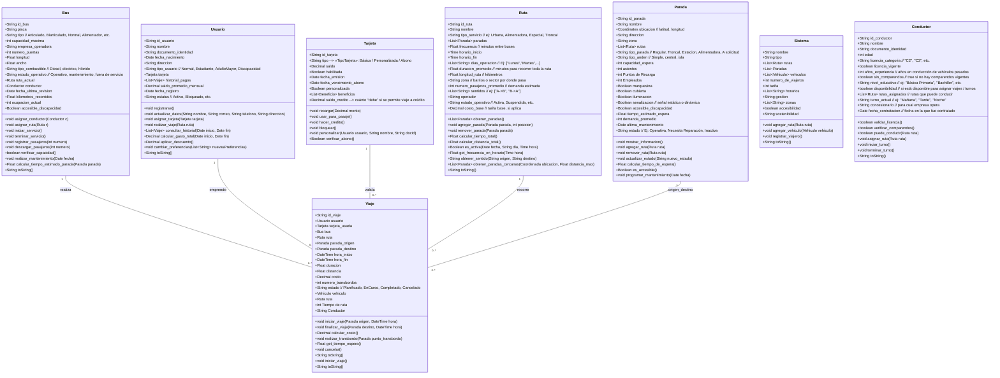

# POO-R2
UML de algo real
### Code
https://es.slideshare.net/slideshow/por-qu-no-funciona-transmilenio-nueva-propuesta/11961002

```mermaid
classDiagram
    class Parada {
        +String id_parada
        +String nombre
        +Coordinates ubicacion        // latitud, longitud
        +String direccion
        +String zona
        +List~Ruta~ rutas
        +String tipo_parada           // Regular, Troncal, Estacion, Alimentadora, A solicitud
        +String tipo_anden            // Simple, central, isla
        +int capacidad_espera
        +int asientos
        +int Puntos de Recarga 
        +int Empleados 
        +Boolean marquesina
        +Boolean cubierta
        +Boolean iluminacion
        +Boolean senalizacion          // señal estática o dinámica
        +Boolean accesible_discapacidad
        +Float tiempo_estimado_espera
        +int demanda_promedio
        +Date ultima_mantenimiento
        +String estado                // Ej: Operativa, Necesita Reparación, Inactiva
      

        +void mostrar_informacion()
        +void agregar_ruta(Ruta ruta)
        +void remover_ruta(Ruta ruta)
        +void actualizar_estado(String nuevo_estado)
        +Float calcular_tiempo_de_espera()
        +Boolean es_accesible()
        +void programar_mantenimiento(Date fecha)
    }

    class Ruta {
        +String id_ruta
        +String nombre
        +String tipo_servicio              // ej: Urbana, Alimentadora, Especial, Troncal
        +List~Parada~ paradas
        +Float frecuencia                  // minutos entre buses
        +Time horario_inicio
        +Time horario_fin
        +List~String~ dias_operacion       // Ej: ["Lunes","Martes",...]
        +Float duracion_promedio           // minutos para recorrer toda la ruta
        +Float longitud_ruta               // kilómetros
        +String zona                       // barrios o sector por donde pasa
        +Int numero_pasajeros_promedio     // demanda estimada
        +List~String~ sentidos             // ej: ["A->B", "B->A"]
        +String operador
        +String estado_operativo           // Activa, Suspendida, etc.
        +Decimal costo_base                // tarifa base, si aplica

        +List~Parada~ obtener_paradas()
        +void agregar_parada(Parada parada, int posicion)
        +void remover_parada(Parada parada)
        +Float calcular_tiempo_total()
        +Float calcular_distancia_total()
        +Boolean es_activa(Date fecha, String dia, Time hora)
        +Float get_frecuencia_en_horario(Time hora)
        +String obtener_sentido(String origen, String destino)
        +List~Parada~ obtener_paradas_cercanas(Coordenada ubicacion, Float distancia_max)
        +String toString()
    }

    class Bus {
        +String id_bus
        +String placa
        +String tipo                // Articulado, Biarticulado, Normal, Alimentador, etc.
        +int capacidad_maxima
        +String empresa_operadora
        +int numero_puertas
        +Float longitud
        +Float ancho
        +String tipo_combustible    // Diesel, electrico, híbrido
        +String estado_operativo     // Operativo, mantenimiento, fuera de servicio
        +Ruta ruta_actual
        +Conductor conductor
        +Date fecha_ultima_revision
        +Float kilometros_recorridos
        +int ocupacion_actual
        +Boolean accesible_discapacidad

        +void asignar_conductor(Conductor c)
        +void asignar_ruta(Ruta r)
        +void iniciar_servicio()
        +void terminar_servicio()
        +void registrar_pasajeros(int numero)
        +void descargar_pasajeros(int numero)
        +boolean verificar_capacidad()
        +void realizar_mantenimiento(Date fecha)
        +Float calcular_tiempo_estimado_parada(Parada parada)
        +String toString()
    }

    class Viaje {
        +String id_viaje
        +Usuario usuario
        +Tarjeta tarjeta_usada
        +Bus bus
        +Ruta ruta
        +Parada parada_origen
        +Parada parada_destino
        +DateTime hora_inicio
        +DateTime hora_fin
        +Float duracion
        +Float distancia
        +Decimal costo
        +int numero_transbordos
        +String estado              // Planificado, EnCurso, Completado, Cancelado

        +void iniciar_viaje(Parada origen, DateTime hora)
        +void finalizar_viaje(Parada destino, DateTime hora)
        +Decimal calcular_costo()
        +void realizar_transbordo(Parada punto_transbordo)
        +Float get_tiempo_espera()
        +void cancelar()
        +String toString()
    }

    Bus "1" -- "0..*" Viaje : realiza
    Usuario "1" -- "0..*" Viaje : emprende
    Tarjeta "1" -- "0..*" Viaje : valida
    Ruta "1" -- "0..*" Viaje : recorre
    Parada "1" -- "0..*" Viaje : origen_destino


    class Viaje {
        +Vehiculo vehiculo
        +Ruta ruta
        +int Tiempo de ruta
        +void iniciar_viaje()
        +String toString()
        +String Conductor
    }

     class Usuario {
        +String id_usuario
        +String nombre
        +String documento_identidad
        +Date fecha_nacimiento
        +String direccion
        +String tipo_usuario           // Normal, Estudiante, AdultoMayor, Discapacidad
        +Tarjeta tarjeta
        +List~Viaje~ historial_pagos
        +Decimal saldo_promedio_mensual
        +Date fecha_registro
        +String estatus               // Activo, Bloqueado, etc.

        +void registrarse()
        +void actualizar_datos(String nombre, String correo, String telefono, String direccion)
        +void asignar_tarjeta(Tarjeta tarjeta)
        +void realizar_viaje(Ruta ruta)
        +List~Viaje~ consultar_historial(Date inicio, Date fin)
        +Decimal calcular_gasto_total(Date inicio, Date fin)
        +Decimal aplicar_descuento()
        +void cambiar_preferencias(List~String~ nuevasPreferencias)
        +String toString()
    }

    class Sistema {
        +String nombre
        +String tipo
        +List~Ruta~ rutas
        +List~Paradas
        +List~Vehiculo~ vehiculos
        +int numero_de_viajeros
        +int tarifa
        +List~String~ horarios
        +String gestion
        +List~String~ zonas
        +boolean accesibilidad
        +String sostenibilidad
        +void agregar_ruta(Ruta ruta)
        +void agregar_vehiculo(Vehiculo vehiculo)
        +void registrar_viajero()
        +String toString()
    }

        class Tarjeta {
        +String id_tarjeta
        +String tipo                 --> «TipoTarjeta»: Básica / Personalizada / Abono
        +Decimal saldo
        +Boolean habilitada
        +Date fecha_emision
        +Date fecha_vencimiento_abono
        +Boolean personalizada
        +List~Beneficio~ beneficios
        +Decimal saldo_credito       --> cuánto “debe” si se permite viaje a crédito
        +void recargar(Decimal monto)
        +void usar_para_pasaje()
        +void hacer_credito()
        +void bloquear()
        +void personalizar(Usuario usuario, String nombre, String docId)
        +Boolean verificar_abono()
    }
     
    class Conductor {
        +String id_conductor
        +String nombre
        +String documento_identidad
        +int edad
        +String licencia_categoria      // "C2", "C3", etc.
        +boolean licencia_vigente
        +int años_experiencia          // años en conducción de vehículos pesados
        +boolean sin_comparendos       // true si no hay comparendos vigentes
        +String nivel_educativo        // ej: "Básica Primaria", "Bachiller", etc.
        +boolean disponibilidad        // si está disponible para asignar viajes / turnos
        +List~Ruta~ rutas_asignadas    // rutas que puede conducir
        +String turno_actual           // ej: "Mañana", "Tarde", "Noche"
        +String concesionario          // para cual empresa opera
        +Date fecha_contratacion       // fecha en la que fue contratado

        +boolean validar_licencia()
        +boolean verificar_comparendos()
        +boolean puede_conducir(Ruta ruta)
        +void asignar_ruta(Ruta ruta)
        +void iniciar_turno()
        +void terminar_turno()
        +String toString()
    }


    
```

