# POO-R2
## Logo del grupo

## UML de algo real
Se abordó de forma superficial a traves de clases y objetos el Sistema Integrado de Transporte Publico Masivo de Bogota, conocido como Transmilenio.

Se modeló paradas, rutas, buses, viajes, usuarios y la infraestructura general del sistema troncal y de buses urbanos.
## Code

```mermaid
classDiagram
    class Parada {
        +String id_parada
        +String nombre
        +string ubicacion    
        +String direccion
        +String zona
        +List~Ruta~ rutas
        
        +void mostrar_informacion()
        +void agregar_ruta(Ruta ruta)
        +void remover_ruta(Ruta ruta)

     
    }

    class ParadaPortalNorte {
        +String id_parada = "PN-001"
        +String nombre = "Portal Norte"
        +String direccion = "Autopista Norte con Calle 175‑176, Bogotá"
        +String zona = "Norte"
        +List~Ruta~ rutas = ["B924", "B75", "B27", "Alimentador Mirandela", "Alimentador Verbenal"]

        +void mostrar_informacion()
        +void agregar_ruta(Ruta ruta)
        +void remover_ruta(Ruta ruta)
    }

    class ParadaSITP_IPN {
        +String id_parada = "SITP‑132"
        +String nombre = "Av. 9 con 127A - Instituto Pedagógico Nacional"
        +String direccion = "Avenida 9 con Calle 127A, Bogotá"
        +String zona = "Norte"
        +List~Ruta~ rutas = ["18‑2 Barrancas", "736 Calle 222 ‑ Paraíso", "T11 Calle 222 ‑ Alpes"]
        

        +void mostrar_informacion()
        +void agregar_ruta(Ruta ruta)
        +void remover_ruta(Ruta ruta)

    }

    Parada <|-- ParadaPortalNorte
    Parada <|-- ParadaSITP_IPN


    class Ruta {
    
        +String nombre
        +String tipo_servicio             
        +List~Parada~ paradas
        +Time horario
        +String zona                      
        +String operador

        +List~Parada~ obtener_paradas()
        +void agregar_parada(Parada parada, int posicion)
        +void remover_parada(Parada parada)
        +List~Parada~ obtener_paradas_cercanas(Coordenada ubicacion, Float distancia_max)
        +String toString()
    }



    class RutaB27 {
        +String nombre = "B27"
        +String tipo = "Troncal"
        +List~String~ paradas = ["Portal Tunal", "Calle 40 Sur", "AV. Jiménez", "Marly", "Calle 72", "Calle 76", "Calle 85"]
        +List~String~ horarios = ["Lunes a Viernes: 04:00-23:00", "Sábados: 05:00-23:00", "Domingos y Festivos: 05:00-22:00"]
        +String operador = "TransMilenio S.A."
        +String zona = "Avenida Caracas"
        +String toString()
    }

    class Ruta639 {
        +String nombre = "639"
        +String tipo = "Zonal"
        +List~String~ paradas = ["Calle 182", "Horizontes Norte", "San Antonio Norte", "La Granja Norte", "San Cristóbal Norte", "Cedritos", "Santa Bárbara Oriental", "Usaquén", "Santa Bárbara Occidental", "Pasadena", "La Castellana", "Las Ferias", "Metrópolis", "Bella Vista Occ.", "Bosque Popular", "El Salitre", "Ciudad Salitre Nor-Oriental", "Salazar Gómez", "Pradera", "Provivienda Oriental", "Alquería", "Venecia", "Muzú", "El Carmen", "Sierra Morena", "Santo Domingo"]
        +List~String~ horarios = ["Lunes a Viernes: 04:30-22:00", "Sábados: 05:00-22:00", "Domingos y Festivos: 05:00-21:00"]
        +String operador = "EGOBUS y CONSORCIO EXPRESS S.A.S"
        +String zona = "Usaquén - Perdomo"
        +String toString()
    }

    Ruta <|-- RutaB27
    Ruta <|-- Ruta639

    class Bus {
        +String id_bus
        +String tipo              
        +int capacidad_maxima
        +String empresa_operadora
        +Ruta ruta_actual
        +Conductor conductor
        +string ubicacion

        +void asignar_conductor(Conductor c)
        +void asignar_ruta(Ruta r)
        +void iniciar_servicio()
        +void terminar_servicio()
        +String toString()
    }


  
    class BusB924 {
        +String id = "B924"
        +String tipo = "Alimentador"
        +String ruta = "Portal Norte - Club Campestre Cafam"
        +String operador = "TransMilenio S.A."
        +int capacidad = 90
        +int conductor = "Juan David Gimenez Castro"
        +String toString()
    }

    class BusL819 {
        +String id = "L819"
        +String tipo = "Complementario"
        +String ruta = "Santa Inés - Portal 20 de Julio"
        +String operador = "SITP"
        +int capacidad = 50
        +String toString()
    }

 
    Bus <|-- BusB924
    Bus <|-- BusL819
    class Viaje {
        +String id_viaje
        +Usuario usuario
        +Tarjeta tarjeta_usada
        +Bus bus
        +Ruta ruta
        +Parada parada_origen
        +Parada parada_destino
        +DateTime hora_inicio
        +DateTime hora_fin
    +int numero_transbordos
        
        +void iniciar_viaje(Parada origen, DateTime hora)
        +void finalizar_viaje(Parada destino, DateTime hora)
        +void realizar_transbordo(Parada punto_transbordo)
        +String toString()
    }
    

    class ViajeAlimentador {
        +String id = "A001"
        +String origen = "Portal Norte"
        +String destino = "Club Campestre Cafam"
        +String fecha = "2025-09-17"
        +String hora_salida = "04:30"
        +String hora_llegada = "05:15"
        +String tipo = "Alimentador"
        +String operador = "TransMilenio S.A."
        +String zona = "Norte"
        +String toString()
    }

   
    class ViajeComplementario {
        +String id = "C001"
        +String origen = "Santa Inés"
        +String destino = "Portal 20 de Julio"
        +String fecha = "2025-09-17"
        +String hora_salida = "04:00"
        +String hora_llegada = "04:30"
        +String tipo = "Complementario"
        +String operador = "SITP"
        +String zona = "Sur"
        +String toString()
    }

    Viaje <|-- ViajeAlimentador
    Viaje <|-- ViajeComplementario


     class Usuario {
        +String id_usuario
        +String nombre
        +String documento_identidad
        +Date fecha_nacimiento
        +String direccion
        +String tipo_usuario          
        +Tarjeta tarjeta
        +String Viaje Previo
        +List~Viaje~ historial_pagos
    
        +Date fecha_registro
        +String estatus               
        +void registrarse()
        +void actualizar_datos(String nombre, String correo, String telefono, String direccion)
        +void asignar_tarjeta(Tarjeta tarjeta)
        +void realizar_viaje(Ruta ruta)
        +List~Viaje~ consultar_historial(Date inicio, Date fin)
        +Decimal aplicar_descuento()
        +String toString()
    }

    
    class Sistema {
        +String nombre
        +String tipo
        +List~Ruta~ rutas
        +List~Parada~ paradas
        +int vehiculos
        +int tarifa
        +List~String~ horarios
        +String gestion
        +List~String~ zonas
        +void agregar_ruta(Ruta ruta)
        +void agregar_vehiculo(Vehiculo vehiculo)
        +String toString()
    }

    class TransMilenio {
        +nombre = "TransMilenio"
        +tipo = "Troncal"
        +tarifa = 3200
        +gestion = "TransMilenio S.A."
        +zonas = ["Avenida Caracas", "Autopista Norte", "Avenida Suba", "Avenida 68"]
        +horarios = ["Lunes a Viernes: 04:00-23:00", "Sábados: 05:00-23:00", "Domingos y Festivos: 05:00-22:00"]
        +rutas = ["B27", "F28", "H27", "J24", "K305", "M82"]
        +void agregar_ruta(Ruta ruta)
        +void agregar_vehiculo(Vehiculo vehiculo)
        +String toString()
    }

 
    class SITP {
        +nombre = "SITP"
        +tipo = "Zonal"
        +numero_de_viajeros = 3000000
        +tarifa = 3200
        +gestion = "TransMilenio S.A."
        +zonas = ["Fontibón", "Usme", "Perdomo", "Suba Centro"]
        +horarios = ["Lunes a Viernes: 04:30-22:00", "Sábados: 05:00-22:00", "Domingos y Festivos: 05:00-21:00"]
        +rutas = ["639", "921", "20-4", "22-3", "18-2", "L819"]
        +void agregar_ruta(Ruta ruta)
        +void agregar_vehiculo(Vehiculo vehiculo)
        +String toString()
    }


    Sistema <|-- TransMilenio
    Sistema <|-- SITP


        class Tarjeta {
        +String id_tarjeta
        +String tipo                 
        +Decimal saldo
        +Boolean habilitada
        +Date fecha_emision
        +Boolean personalizada
        +List~Beneficio~ beneficios
        +Decimal saldo_credito 
        +void recargar(Decimal monto)
        +void usar_para_pasaje()
        +void hacer_credito()
        +void bloquear()
        +void personalizar(Usuario usuario, String nombre, String docId)
    }
     
    class Conductor {
        +String id_conductor
        +String nombre
        +String documento_identidad
        +int edad
        +String licencia_categoria      
        +List~Ruta~ rutas_asignadas    
        +String turno_actual           
        +Date fecha_contratacion 

        +void asignar_ruta(Ruta ruta)
        +void iniciar_turno()
        +void terminar_turno()
        +String toString()


    
    

        
    }

    Parada <|-- ParadaPortalNorte
    Parada <|-- ParadaSITP_IPN
    Ruta <|-- RutaB27
    Ruta <|-- Ruta639
    Bus <|-- BusB924
    Bus <|-- BusL819
    Viaje <|-- ViajeAlimentador
    Viaje <|-- ViajeComplementario
    Sistema <|-- TransMilenio
    Sistema <|-- SITP

    Ruta *-- Parada
    Bus *-- Conductor
    Viaje *-- Bus
    Viaje o-- Ruta
    Viaje o-- Parada : parada_origen
    Viaje o-- Parada : parada_destino
    Sistema o-- Ruta
    Sistema o-- Parada
    Sistema o-- Vehiculo
    Usuario o-- Tarjeta



    





    
```

